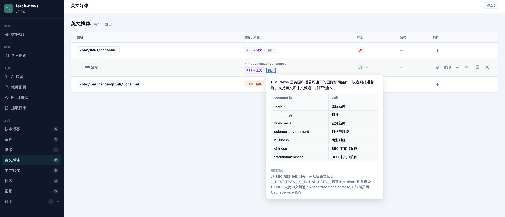
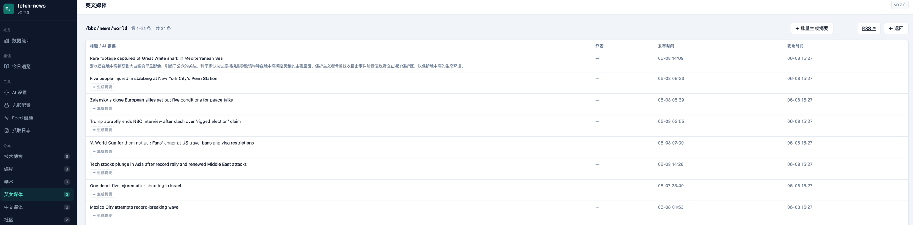
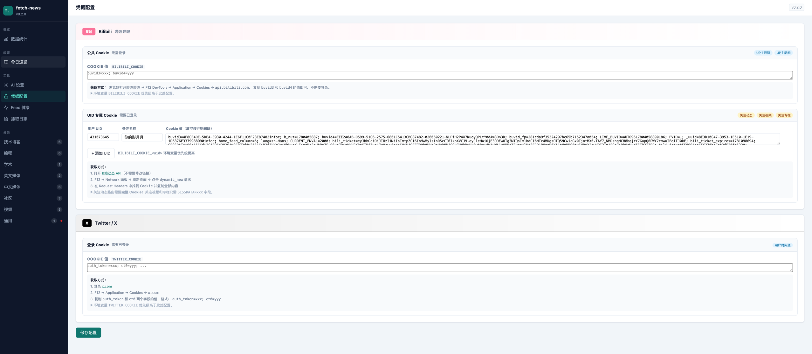

# fetch-news

信息爆炸时代的个人信息过滤器。自托管 RSS 聚合服务，精选高质量信息源，接入本地 Ollama 做翻译和摘要。

每个路由都输出标准 RSS，可直接用任意订阅器消费；内置 Web 阅读器，支持按分类浏览、AI 摘要一键生成、书签收藏。







## 信息源

| 分类 | 路由 | 来源 |
|------|------|------|
| 技术博客 | `/techcrunch` | TechCrunch |
| 技术博客 | `/wired/latest` | WIRED |
| 技术博客 | `/mritd/blog` | mritd |
| 技术博客 | `/microsoft/devops` | Microsoft DevOps Blog |
| 技术博客 | `/diygod/blog` | DIYGod |
| 编程 | `/github/releases/:owner/:repo` | GitHub Releases |
| 编程 | `/hn/:feed` | Hacker News（top / new / best / ask / show / job） |
| 编程 | `/cnblogs/post` | 博客园精华 |
| 学术 | `/arxiv/:category` | arXiv（cs.AI / cs.LG / cs.CV 等） |
| 英文媒体 | `/bbc/news/:channel` | BBC News 全文 |
| 英文媒体 | `/bbc/learningenglish/:channel` | BBC 英语学习 |
| 中文媒体 | `/sspai/articles` | 少数派 |
| 中文媒体 | `/36kr/news` | 36氪 |
| 中文媒体 | `/huanqiu/news` | 环球网 |
| 中文媒体 | `/huanqiu/tech/:section` | 环球网科技 |
| 中文媒体 | `/xinhua/news` | 新华网 |
| 中文媒体 | `/cctv/news/:category` | 央视新闻 |
| 社区 | `/twitter/user/:id` | Twitter/X 用户时间线 |
| 社区 | `/producthunt/daily` | Product Hunt 每日精选 |
| 视频 | `/bilibili/user/video/:uid` | B站 UP主视频 |
| 视频 | `/bilibili/user/dynamic/:uid` | B站 UP主动态 |
| 视频 | `/bilibili/followings/dynamic/:uid` | B站关注动态（全量） |
| 视频 | `/bilibili/followings/video/:uid` | B站关注视频动态 |
| 视频 | `/bilibili/followings/article/:uid` | B站关注专栏 |
| 通用 | `/rss` | 任意 RSS 2.0 / Atom 源 |

## AI 摘要

通过本地 Ollama 接入，在管理后台配置 host 和模型即可。抓取完成后自动对文章做摘要，英文内容可配合模型做翻译。默认模型 `llama3.2`，无需外部 API，数据不出本机。

## 运行

**Docker（推荐）**

```bash
docker compose up -d
```

访问 `http://localhost:8080`，后台管理在 `http://localhost:8080/index`。

**本地开发**

```bash
./gradlew bootRun   # 需要 JDK 25
```

## 凭据配置

在 `docker-compose.yml` 中按需填写：

- `BILIBILI_COOKIE` — B站公开路由（无需登录，填 buvid3/buvid4 即可）
- `BILIBILI_COOKIE_<uid>` — 关注动态路由，需已登录账号的完整 Cookie
- `TWITTER_COOKIE` — Twitter 路由，需 `auth_token` + `ct0`
- `OLLAMA_HOST` — Docker 内访问宿主机 Ollama 时填 `http://host.docker.internal:11434`

## 后续计划

- [ ] 推送到微信和飞书（定时/触发式）
- [ ] 一键聚合推送，生成公众号文章

## 技术栈

Spring Boot · Thymeleaf + HTMX + Alpine.js · JSoup · SQLite · Caffeine · Ollama · Java 25
